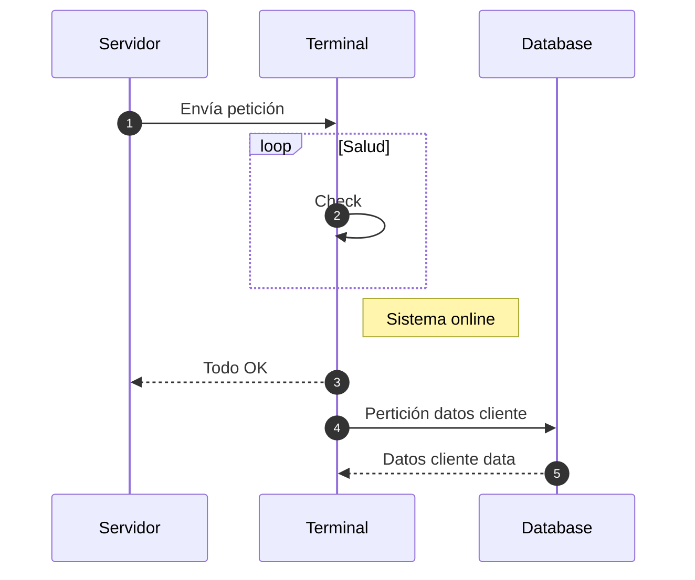

esto es un ejemplo de esquema de funcionamiento de petición a una BBDD

```mermaid
sequenceDiagram
  autonumber
  Servidor->>Terminal: Envía petición
  loop Salud
      Terminal->>Terminal: Check
  end
  Note right of Terminal: Sistema online
  Terminal-->>Servidor: Todo OK
  Terminal->>Database: Pertición datos cliente
  Database-->>Terminal: Datos cliente data
```